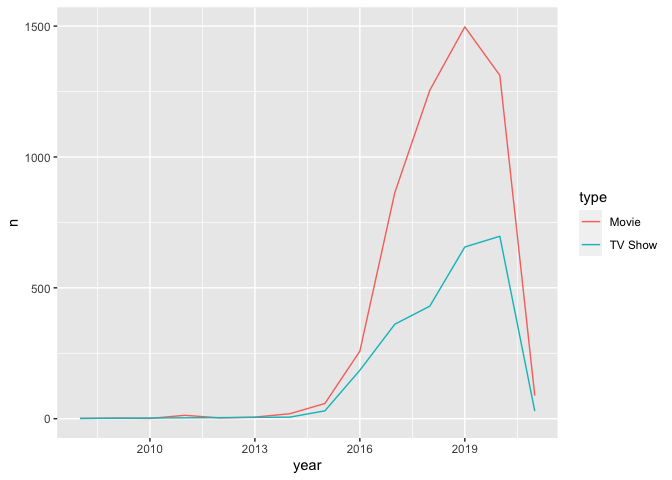
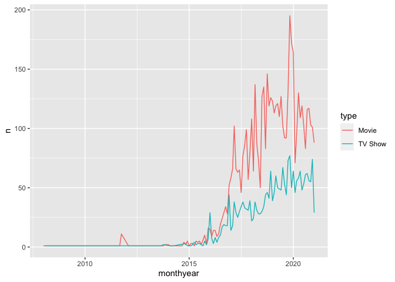
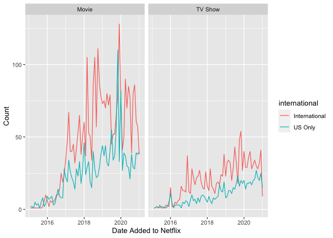
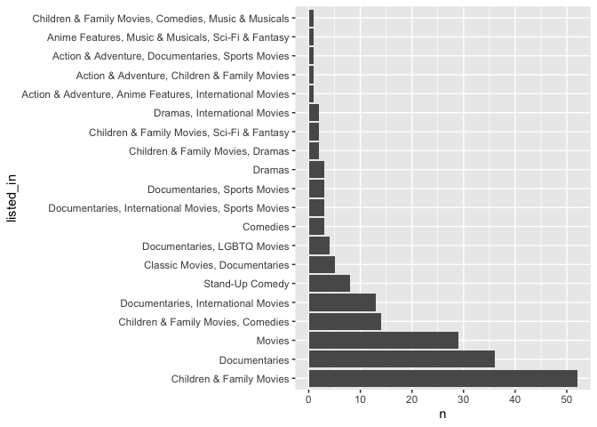
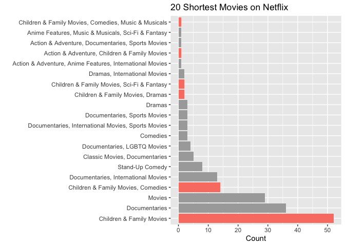
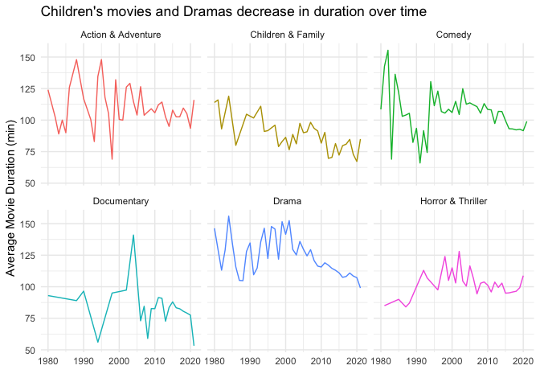

# Load library and dataset


```r
library(tidyverse)
library(lubridate)

netflix_titles <- readr::read_csv('https://raw.githubusercontent.com/rfordatascience/tidytuesday/master/data/2021/2021-04-20/netflix_titles.csv')
netflix_titles
```

```
## # A tibble: 7,787 x 12
##    show_id type   title director cast     country date_added release_year rating
##    <chr>   <chr>  <chr> <chr>    <chr>    <chr>   <chr>             <dbl> <chr> 
##  1 s1      TV Sh… 3%    <NA>     João Mi… Brazil  August 14…         2020 TV-MA 
##  2 s2      Movie  7:19  Jorge M… Demián … Mexico  December …         2016 TV-MA 
##  3 s3      Movie  23:59 Gilbert… Tedd Ch… Singap… December …         2011 R     
##  4 s4      Movie  9     Shane A… Elijah … United… November …         2009 PG-13 
##  5 s5      Movie  21    Robert … Jim Stu… United… January 1…         2008 PG-13 
##  6 s6      TV Sh… 46    Serdar … Erdal B… Turkey  July 1, 2…         2016 TV-MA 
##  7 s7      Movie  122   Yasir A… Amina K… Egypt   June 1, 2…         2019 TV-MA 
##  8 s8      Movie  187   Kevin R… Samuel … United… November …         1997 R     
##  9 s9      Movie  706   Shravan… Divya D… India   April 1, …         2019 TV-14 
## 10 s10     Movie  1920  Vikram … Rajnees… India   December …         2008 TV-MA 
## # … with 7,777 more rows, and 3 more variables: duration <chr>,
## #   listed_in <chr>, description <chr>
```

Clean up the date

```r
head(netflix_titles$date_added)
```

```
## [1] "August 14, 2020"   "December 23, 2016" "December 20, 2018"
## [4] "November 16, 2017" "January 1, 2020"   "July 1, 2017"
```

```r
netflix_titles <- netflix_titles %>%
  mutate(date_added = parse_date(date_added, format = "%B %d, %Y"))
```

Create a basic plot showing the number of TV shows and Movies added over time


```r
netflix_titles %>%
  group_by(year = year(date_added)) %>%
  count(type) %>%
  ggplot(aes(year, n)) + geom_line(aes(group = type, color = type))
```

<!-- -->

```r
# see this by month instead
netflix_titles %>%
  mutate(monthyear = floor_date(date_added, "month")) %>% 
  group_by(monthyear) %>%
  count(type) %>%
  ggplot(aes(monthyear, n)) + geom_line(aes(group = type, color = type))
```

<!-- -->

Is the number of international titles increasing?


```r
netflix_titles %>% count(country) %>% filter(str_detect(country, "United States"))
```

```
## # A tibble: 320 x 2
##    country                                                                     n
##    <chr>                                                                   <int>
##  1 Argentina, France, United States, Germany, Qatar                            1
##  2 Argentina, United States                                                    1
##  3 Argentina, United States, Mexico                                            1
##  4 Australia, Armenia, Japan, Jordan, Mexico, Mongolia, New Zealand, Phil…     1
##  5 Australia, New Zealand, United States                                       1
##  6 Australia, United Kingdom, United States, New Zealand, Italy, France        1
##  7 Australia, United States                                                   10
##  8 Austria, Iraq, United States                                                1
##  9 Austria, United States                                                      1
## 10 Belgium, United Kingdom, United States                                      1
## # … with 310 more rows
```

```r
netflix_titles %>% count(country) %>% filter(country == "United States")
```

```
## # A tibble: 1 x 2
##   country           n
##   <chr>         <int>
## 1 United States  2555
```

```r
# if it has any other country I'll call it an international film
netflix_titles %>% 
  mutate(international = if_else(country == "United States", "US", "international")) %>% count(international)
```

```
## # A tibble: 3 x 2
##   international     n
## * <chr>         <int>
## 1 international  4725
## 2 US             2555
## 3 <NA>            507
```

```r
# make the plot
netflix_titles %>% 
  mutate(international = if_else(country == "United States", "US Only", "International"),
         monthyear = floor_date(date_added, "month")) %>%
  filter(monthyear > "2015-01-01") %>%
  drop_na(international) %>%
  group_by(monthyear) %>%
  count(type, international) %>%
  ggplot(aes(monthyear, n)) + 
  geom_line(aes(group = international, color = international)) + 
  facet_wrap(~type) +
  labs(x = "Date Added to Netflix", y = "Count")
```

<!-- -->

Play with the duration


```r
netflix_titles %>%
  separate(duration, into = c("duration_number", "duration_units"), sep = " ") %>%
  mutate(duration_number = as.numeric(duration_number)) %>%
  filter(duration_units == "min") %>%
  count(type)
```

```
## # A tibble: 1 x 2
##   type      n
## * <chr> <int>
## 1 Movie  5377
```

```r
# all items with duration units of min are all movies
```

See the longest movies (that I never want to watch)


```r
netflix_titles %>%
  separate(duration, into = c("duration_number", "duration_units"), sep = " ") %>%
  mutate(duration_number = as.numeric(duration_number)) %>%
  filter(duration_units == "min") %>%
  arrange(-duration_number) %>%
  select(title, listed_in, duration_number)
```

```
## # A tibble: 5,377 x 3
##    title                  listed_in                              duration_number
##    <chr>                  <chr>                                            <dbl>
##  1 Black Mirror: Banders… Dramas, International Movies, Sci-Fi …             312
##  2 The School of Mischief Comedies, Dramas, International Movies             253
##  3 No Longer kids         Comedies, Dramas, International Movies             237
##  4 Lock Your Girls In     Comedies, International Movies, Roman…             233
##  5 Raya and Sakina        Comedies, Dramas, International Movies             230
##  6 Sangam                 Classic Movies, Dramas, International…             228
##  7 Lagaan                 Dramas, International Movies, Music &…             224
##  8 Jodhaa Akbar           Action & Adventure, Dramas, Internati…             214
##  9 Kabhi Khushi Kabhie G… Dramas, International Movies                       209
## 10 The Irishman           Dramas                                             209
## # … with 5,367 more rows
```

See the shortest movies - are they all kids movies?


```r
netflix_titles %>%
  separate(duration, into = c("duration_number", "duration_units"), sep = " ") %>%
  mutate(duration_number = as.numeric(duration_number)) %>%
  filter(duration_units == "min") %>%
  arrange(duration_number) %>%
  count(title, listed_in, duration_number)
```

```
## # A tibble: 5,377 x 4
##    title                 listed_in                         duration_number     n
##    <chr>                 <chr>                                       <dbl> <int>
##  1 ¡Ay, mi madre!        Comedies, International Movies                 81     1
##  2 '89                   Sports Movies                                  87     1
##  3 (T)ERROR              Documentaries                                  84     1
##  4 #Alive                Horror Movies, International Mov…              99     1
##  5 #AnneFrank - Paralle… Documentaries, International Mov…              95     1
##  6 #cats_the_mewvie      Documentaries, International Mov…              90     1
##  7 #FriendButMarried     Dramas, International Movies, Ro…             102     1
##  8 #FriendButMarried 2   Dramas, International Movies, Ro…             104     1
##  9 #realityhigh          Comedies                                       99     1
## 10 #Roxy                 Comedies, Romantic Movies                     105     1
## # … with 5,367 more rows
```

```r
# count the kids movies
netflix_titles %>%
  separate(duration, into = c("duration_number", "duration_units"), sep = " ") %>%
  mutate(duration_number = as.numeric(duration_number)) %>%
  filter(duration_units == "min") %>%
  arrange(duration_number) %>%
  head(200) %>%
  count(listed_in) %>%
  arrange(-n)
```

```
## # A tibble: 36 x 2
##    listed_in                                              n
##    <chr>                                              <int>
##  1 Children & Family Movies                              52
##  2 Documentaries                                         36
##  3 Movies                                                29
##  4 Children & Family Movies, Comedies                    14
##  5 Documentaries, International Movies                   13
##  6 Stand-Up Comedy                                        8
##  7 Classic Movies, Documentaries                          5
##  8 Documentaries, LGBTQ Movies                            4
##  9 Comedies                                               3
## 10 Documentaries, International Movies, Sports Movies     3
## # … with 26 more rows
```

```r
# make a plot
netflix_titles %>%
  separate(duration, into = c("duration_number", "duration_units"), sep = " ") %>%
  mutate(duration_number = as.numeric(duration_number)) %>%
  filter(duration_units == "min") %>%
  arrange(duration_number) %>%
  head(200) %>%
  count(listed_in) %>%
  arrange(-n) %>%
  head(20) %>%
  mutate(listed_in = as_factor(listed_in)) %>%
  ggplot(aes(n, listed_in)) + geom_col()
```

<!-- -->

```r
# if the movie is ever listed in Children's turn it red
netflix_titles %>%
  separate(duration, into = c("duration_number", "duration_units"), sep = " ") %>%
  mutate(duration_number = as.numeric(duration_number)) %>%
  filter(duration_units == "min") %>%
  arrange(duration_number) %>%
  head(200) %>%
  count(listed_in) %>%
  arrange(-n) %>%
  head(20) %>%
  mutate(listed_in = as_factor(listed_in)) %>%
  mutate(red = case_when(str_detect(listed_in, "Children") ~ "red",
                         TRUE ~ "black")) %>%
  ggplot(aes(n, listed_in)) + geom_col(aes(fill = red)) +
  scale_fill_manual(values = c("darkgrey", "salmon")) +
  theme(legend.position = "none") +
  labs(x = "Count", y = "", title = "20 Shortest Movies on Netflix")
```

<!-- -->

Are children's movies decreasing in duration over time?

Clean up the listed_in to create some cleaner genres


```r
netflix_titles %>% 
  filter(type == "Movie") %>%
  count(listed_in) %>% 
  arrange(-n)
```

```
## # A tibble: 265 x 2
##    listed_in                                            n
##    <chr>                                            <int>
##  1 Documentaries                                      334
##  2 Stand-Up Comedy                                    321
##  3 Dramas, International Movies                       320
##  4 Comedies, Dramas, International Movies             243
##  5 Dramas, Independent Movies, International Movies   215
##  6 Children & Family Movies                           177
##  7 Documentaries, International Movies                172
##  8 Children & Family Movies, Comedies                 169
##  9 Comedies, International Movies                     161
## 10 Dramas, International Movies, Romantic Movies      153
## # … with 255 more rows
```

```r
top6genre <- netflix_titles %>%
  separate(duration, into = c("duration_number", "duration_units"), sep = " ") %>%
  mutate(duration_number = as.numeric(duration_number)) %>%
  filter(duration_units == "min") %>%
  mutate(genre = case_when(
    str_detect(listed_in, "Children") ~ "Children & Family",
    str_detect(listed_in, "Comed") ~ "Comedy",
    str_detect(listed_in, "Drama") ~ "Drama",
    str_detect(listed_in, "Roman") ~ "Romance",
    str_detect(listed_in, "Action") ~ "Action & Adventure",
    str_detect(listed_in, "Documentar") ~ "Documentary",
    str_detect(listed_in, "Horror") | 
      str_detect(listed_in, "Thrill") ~ "Horror & Thriller",
                         TRUE ~ listed_in)) %>%
  count(genre) %>%
  arrange(-n) %>%
  head(6)
```

Make the plot

```r
theme_set(theme_minimal() + theme(legend.position = 'blank'))

netflix_titles %>%
  filter(release_year >= 1980) %>%
  separate(duration, into = c("duration_number", "duration_units"), sep = " ") %>%
  mutate(duration_number = as.numeric(duration_number)) %>%
  filter(duration_units == "min") %>%
  mutate(genre = case_when(
    str_detect(listed_in, "Children") ~ "Children & Family",
    str_detect(listed_in, "Comed") ~ "Comedy",
    str_detect(listed_in, "Drama") ~ "Drama",
    str_detect(listed_in, "Roman") ~ "Romance",
    str_detect(listed_in, "Action") ~ "Action & Adventure",
    str_detect(listed_in, "Documentar") ~ "Documentary",
    str_detect(listed_in, "Horror") | str_detect(listed_in, "Thrill") ~ "Horror & Thriller",
                         TRUE ~ listed_in)) %>%
  filter(genre %in% top6genre$genre) %>%
  group_by(genre, release_year) %>%
  summarize(Duration = mean(duration_number)) %>%
  ggplot(aes(release_year, Duration)) + 
  geom_line(aes(group = genre, color = genre)) +
  facet_wrap(~genre) +
  labs(x = "", y = "Average Movie Duration (min)", title = "Children's movies and Dramas decrease in duration over time")
```

<!-- -->

